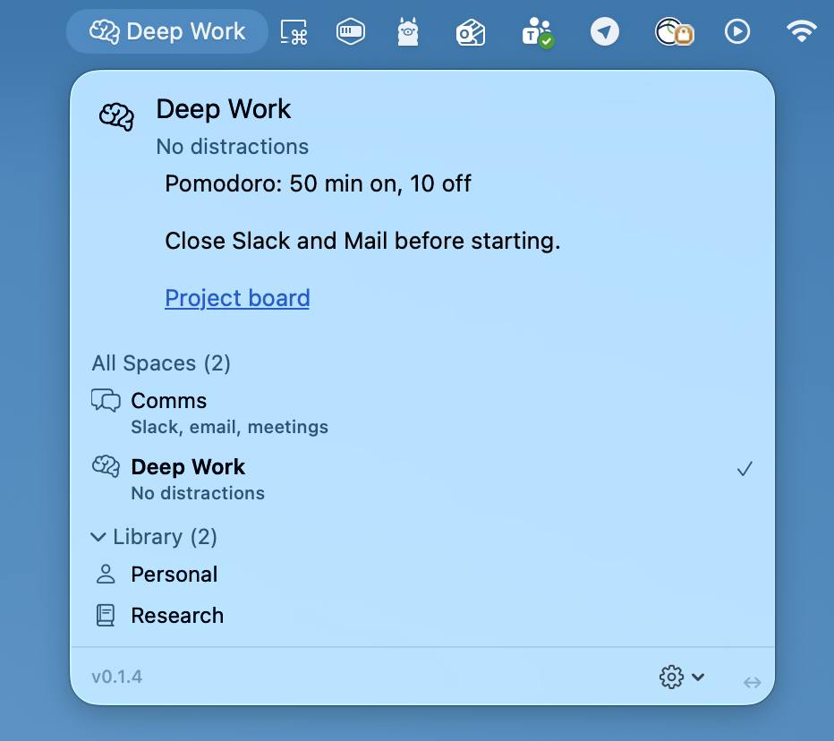

# Balanced Spaces



Give each macOS Space a name, icon, and notes. Switch desktops and always know where you are.

## Requirements

macOS 14+

## Install

Download the latest `.app` from [Releases](../../releases) and drag it to your Applications folder.

Or build from source — see [Development](#development).

## How it works

macOS Spaces have no labels. Balanced Spaces lives in your menu bar, detects which Space you've switched to, and shows the name, icon, and notes you've assigned to it. Switch with Ctrl+← / Ctrl+→ and the menu updates instantly.

## Features

- **Per-Space identity** — name and custom icon so you can tell Spaces apart at a glance.
- **Notes** — write anything: context, links, reminders. Supports text highlighting.
- **Clickable links** — URLs are auto-detected. Use `[label](url-or-~/path)` for labeled links; folder paths open in Terminal.
- **Read-only by default** — hover a row to reveal the edit pencil; press Done to save or Cancel to discard.
- **Backup & restore** — export your setup to a file and restore it on any Mac.
- **Menu bar only** — no Dock icon, no clutter.

## Development

**Build and run:**
```
./scripts/package.sh
```

**Cut a release:**
```
./scripts/release.sh 0.1.5
```
This dates the `[Unreleased]` section in `CHANGELOG.md`, bumps the version in `Info.plist`, commits, and tags `v0.1.5`.

Built with Swift, SwiftUI, and AppKit.
